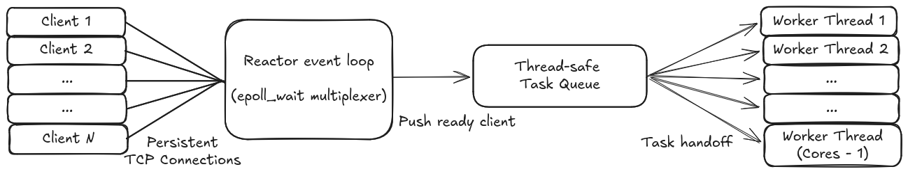

# Architecture: High-Performance C++ HTTP Server

## 1. System Overview

This framework is a zero-dependency, non-blocking HTTP/1.1 web server engineered in modern C++ to maximize hardware utilization. It is designed to handle massive concurrency by bridging an asynchronous, event-driven network layer with a hardware-scaled worker thread pool.

**Core Components:**
*   **TCP Socket Layer:** Manages strictly non-blocking network connections to ensure the server is never stalled by slow clients.
*   **Reactor Event Loop (`epoll`):** Acts as the single control thread, monitoring socket readiness in $O(1)$ time and dispatching active file descriptors.
*   **Worker Pool & Task Queue:** A dynamically scaled pool of reusable threads that process incoming requests, completely eliminating thread creation overhead.
*   **HTTP Parser:** A zero-copy deserializer that relies on `std::string_view` to slice byte streams without triggering dynamic heap allocations.
*   **Middleware Pipeline:** A Chain of Responsibility architecture that securely decouples request routing, logging, static file serving, and security logic.

## 2. Concurrency & I/O Model

This framework handles thousands of simultaneous connections by splitting the server's workload into two completely separate jobs: one part of the server only listens for incoming network data, while a separate pool of threads does the heavy lifting of actually reading and responding to the HTTP requests.

### The Problem: OS-Level Bottlenecks
The naive "thread-per-connection" or "process-per-connection" models scale poorly under heavy load. Allocating a dedicated OS thread for every idle client consumes massive amounts of RAM (due to thread stack allocation) and forces the CPU into continuous, expensive context-switching. Furthermore, older event-polling mechanisms like `select()` or `poll()` degrade in $O(N)$ time, as they require scanning the entire list of file descriptors to find active ones.

### The Solution: The Reactor Pattern via `epoll`
To achieve high concurrency with a minimal hardware footprint, this server implements the **Reactor Pattern** utilizing the Linux `epoll` API. 
*   **Edge-Triggered Event Loop:** A single, dedicated reactor thread monitors all incoming client TCP sockets. Using `epoll`, the operating system notifies the server in $O(1)$ time exactly which file descriptors have data ready to be read.
*   **Non-Blocking I/O:** All sockets are configured to be strictly non-blocking. The reactor thread never waits for a socket to finish transmitting data; it simply reacts to readiness events, ensuring the main loop is never starved or stalled by a slow network client.

### Execution: Pre-Allocated Worker Pool
Once the `epoll` loop detects a socket is ready for processing, it does not process the HTTP payload itself. Instead, it dispatches the active file descriptor to a synchronized **Task Queue**.
*   **Fixed-Size Thread Pool:** Upon startup, the server pre-allocates a fixed pool of worker threads (scaled dynamically to the host machine's hardware thread count). 
*   **Zero Creation Overhead:** Worker threads sleep on a `std::condition_variable` until a task is available. By reusing threads rather than creating and destroying them per request, the framework entirely eliminates thread lifecycle overhead.

  

## 3. Memory Management & Resource Ownership

This framework is optimized to minimize dynamic heap allocations and completely eliminate deep copies during the request-response cycle.

### Zero-Copy Request Parsing
String manipulation is traditionally one of the most expensive operations in an HTTP server. To mitigate this, the `HttpRequest` parser relies heavily on C++17's `std::string_view`.
*   Instead of copying the incoming byte stream into newly allocated `std::string` objects for the HTTP method, URI, and headers, the parser simply creates lightweight, read-only windows (`std::string_view`) over the original network buffer. 
*   This approach avoids triggering dynamic heap allocations (`new`/`malloc`) during the parsing phase, keeping CPU cache misses to an absolute minimum.

### Move Semantics and Ownership
The server strictly enforces resource ownership using modern C++ move semantics to prevent expensive deep copies of large data structures.
*   **Routing and Handlers:** When registering lambda functions with the `DynamicRouter`, handlers are moved (`std::move`) into the internal routing tables rather than copied.
*   **Payload Transfer:** Large HTTP bodies and response payloads transfer ownership across the application boundaries via move semantics, ensuring that the memory footprint remains flat regardless of payload size.

### Deterministic Memory (RAII)
The framework completely avoids raw memory management (`new`/`delete`). 
*   The middleware pipeline (Logging, Security, Routing, etc.) is constructed using `std::unique_ptr`. 
*   By passing ownership via `std::move`, the pipeline forms a recursive data structure. This guarantees that all nodes are safely and deterministically destroyed top-down when the head of the chain falls out of scope, entirely eliminating the risk of memory leaks and forcing a safe, leak-proof API design for the user.

## 4. The Request Lifecycle (Middleware Pattern)

Once a worker thread claims a ready socket and parses the incoming bytes into an `HttpRequest` object, the request is passed through a modular processing pipeline before an `HttpResponse` is sent back to the client.

### The Chain of Responsibility
The server's application logic is built on the **Chain of Responsibility** design pattern, utilizing a common `IMiddleware` interface.
*   **Decoupled Architecture:** Instead of a monolithic routing function, the request flows sequentially through isolated middleware nodes (e.g., `LoggingMiddleware` -> `SecurityMiddleware` -> `RouterMiddleware` -> `StaticFileMiddleware`).
*   **Short-Circuiting:** Any middleware node has the authority to halt the chain. For example, if the `SecurityMiddleware` detects a malformed header or malicious payload, it can instantly return an `HttpResponse` (like a 400 Bad Request) without wasting CPU cycles running the routing logic.
*   **Extensibility:** New features (such as Rate Limiting, CORS handling, or Authentication) can be safely inserted into the pipeline during server initialization without modifying the existing routing or core server code.

### Request Routing
If the request successfully passes through the preliminary middleware, it reaches the routing layers:
*   **Dynamic Routing:** The `DynamicRouter` maps HTTP methods (GET, POST) and URIs to specific C++ lambda functions. These routes are stored in hash maps (`std::unordered_map`), guaranteeing near O(1) lookup times even with hundreds of registered API endpoints.
*   **Static Fallback:** If the `DynamicRouter` cannot find a matching API endpoint, the request falls through to the `StaticFileMiddleware`, which safely attempt to serve HTML, CSS, or JS files from the designated public directory.
